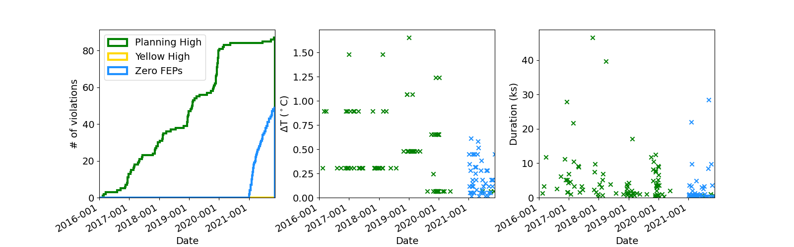
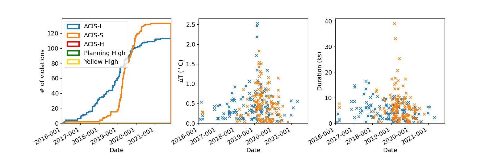

Long-Term Violation Trends
--------------------------

1DPAMZT Violations
==================

1DEAMZT Violations
==================

.. image:: _static/hist_1deamzt.png

1PDEAAT Violations
==================

.. image:: _static/hist_1pdeaat.png

FPTEMP_11 Violations
====================

TMP_FEP1_MONG Violations
========================

.. image:: _static/hist_tmp_fep1_mong.png

TMP_FEP1_ACTEL Violations
=========================

.. image:: _static/hist_tmp_fep1_actel.png

TMP_BEP_PCB Violations
======================

.. image:: _static/hist_tmp_bep_pcb.png
